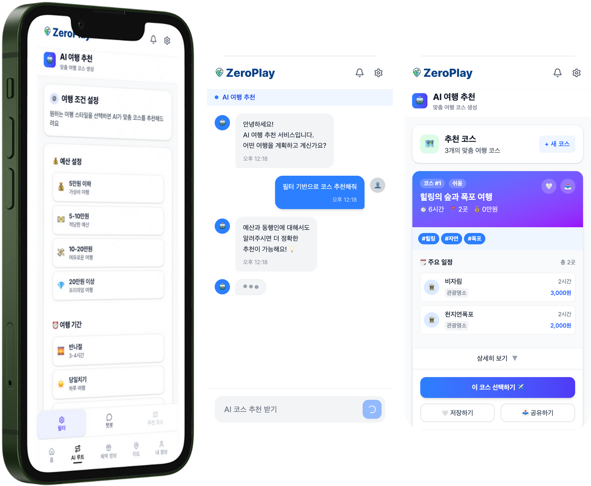
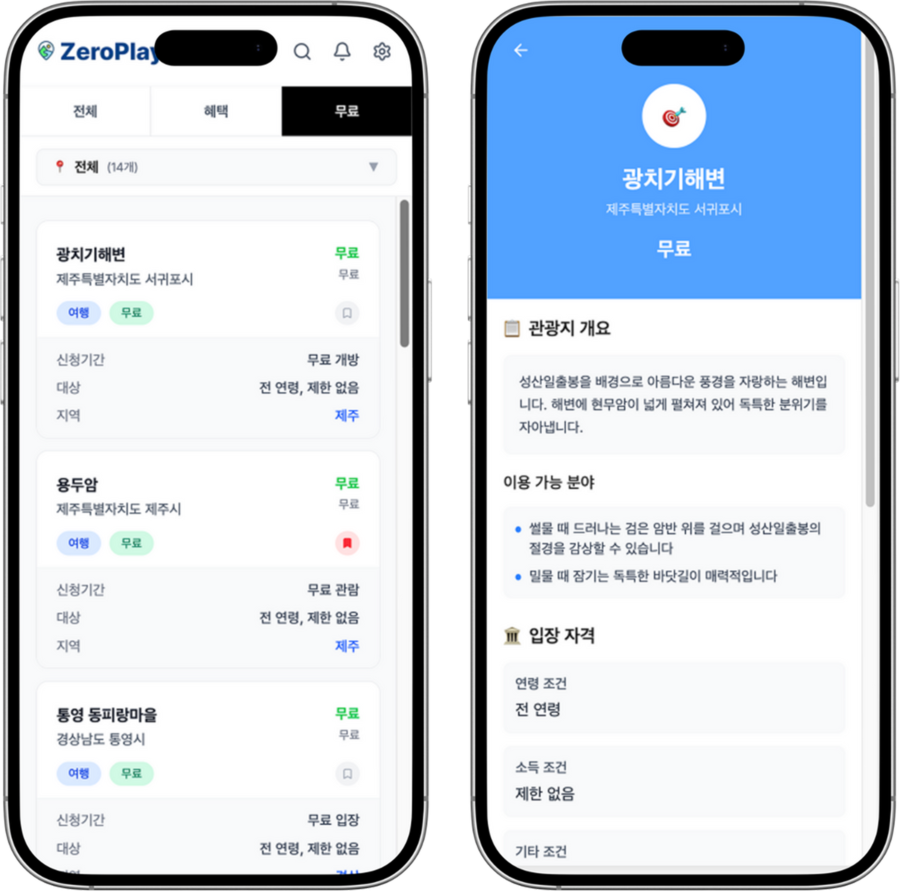

# ZeroPlay - 청년 맞춤형 여행 플랫폼

<div align="center">


**부담을 덜고, 온전한 나를 채우다**

[](https://nextjs.org/)
[](https://www.typescriptlang.org/)
[](https://supabase.com/)

</div>

---

## 프로젝트 소개

**ZeroPlay**는 청년들을 위한 **AI 기반 맞춤형 로컬 여행 플랫폼**입니다.  
여행 계획부터 실행까지, 청년 혜택 정보와 로컬딜을 결합하여 **가성비 높은 여행**을 제공합니다.

### 핵심 가치

- **AI 맞춤 추천**: 개인화된 여행 코스 자동 생성
- **청년 혜택 통합**: 교통비, 숙박비, 문화패스 등 실질적 혜택 정보 제공
- **로컬딜 연동**: 지역 소상공인과 여행자를 연결하는 특가 정보

---

## 주요 기능

### 1. AI 루트 추천
<div align="center">
  
</div>

- **대화형 AI**: 자연어로 여행 취향 입력
- **맞춤 코스 생성**: 예산, 기간, 동행자, 관심사 기반 최적 루트 추천
- **실시간 수정**: 코스 저장 및 수정 가능
- **북마크 기능**: 마음에 드는 코스 저장

**주요 기술**
- OpenAI GPT-3.5 Turbo
- Semantic Search (Embedding 기반)

---

### 2. 청년 혜택 정보
<div align="center">
  
</div>

- **실시간 혜택 정보**: 전국/지역별 청년 지원 프로그램
- **카테고리별 필터링**: 교통, 숙박, 문화, 쇼핑 등
- **지역별 검색**: 서울, 수도권, 강원, 충청, 전라, 경상, 제주
- **북마크**: 관심 혜택 저장

**수집 데이터**
- 청년쉼표 프로젝트 (최대 50만원)
- K-패스 교통비 할인 (20-53%)
- 청년도약계좌
- 지역별 여행 지원금

---

### 3. 인터랙티브 지도 & 로컬딜
<div align="center">
  
</div>

- **카카오맵 연동**: 실시간 위치 기반 스팟 탐색
- **카테고리별 필터**: 체험, 문화, 맛집, 카페
- **로컬딜 마커**: 할인 정보 제공 가게 시각화
- **상세 정보**: 운영시간, 평점, 가격대, 예약 링크

**로컬딜 시스템**
- 빈 시간대 할인 (비수기/비시간대)
- 재료 소진 할인 (당일 마감)
- 신규 고객 쿠폰
- 1+1, 할인율, 무료 서비스 등 다양한 형태

---

### 4. 마이페이지
- **저장된 AI 코스**: 북마크한 여행 루트 관리
- **청년 혜택 북마크**: 관심 혜택 모아보기
- **지도 장소 북마크**: 가고 싶은 스팟 저장
- **통계 대시보드**: 예상 여행 예산, 저장 개수 등

---

## 시스템 아키텍처

```
┌─────────────────────────────────────────────────────────────┐
│                         Frontend (Next.js 15)               │
│  ┌──────────────┐  ┌──────────────┐  ┌──────────────┐       │
│  │   AI Route   │  │   Benefits   │  │   Map View   │       │
│  │  (Chat UI)   │  │   (Filter)   │  │ (Kakao Maps) │       │
│  └──────────────┘  └──────────────┘  └──────────────┘       │
└───────────────────────────────┬─────────────────────────────┘
                                │ REST API
                                ↓
┌─────────────────────────────────────────────────────────────┐
│                    Backend (Express + TypeScript)           │
│  ┌──────────────┐  ┌──────────────┐  ┌──────────────┐       │
│  │ AI Controller│  │   Benefit    │  │   Bookmark   │       │
│  │  (OpenAI)    │  │  Controller  │  │  Controller  │       │
│  └──────┬───────┘  └──────┬───────┘  └──────┬───────┘       │
│         │                 │                 │               │
│         └─────────────────┴─────────────────┘               │
│                            ↓                                │
│                   ┌────────────────┐                        │
│                   │  Supabase SDK  │                        │
│                   └────────────────┘                        │
└───────────────────────────────┬─────────────────────────────┘
                                │
                                ↓
┌─────────────────────────────────────────────────────────────┐
│                       Supabase (PostgreSQL)                 │
│   ┌──────────────┐  ┌──────────────┐  ┌──────────────┐      │
│   │ local_spots  │  │   benefits   │  │   bookmarks  │      │
│   │  (장소 데이터)  │  │  (혜택 정보)   │  │  (사용자 저장)  │      │
│   └──────────────┘  └──────────────┘  └──────────────┘      │
└─────────────────────────────────────────────────────────────┘
```

---

## 기술 스택

### Frontend
- **Framework**: Next.js 15.5.2 (App Router, Turbopack)
- **Language**: TypeScript 5.3.2
- **Styling**: Tailwind CSS 4.0
- **UI Components**: Lucide React (아이콘)
- **Maps**: react-kakao-maps-sdk (카카오맵 연동)
- **State Management**: React Hooks (useState, useEffect, useCallback)

### Backend
- **Runtime**: Node.js 20.x
- **Framework**: Express 4.18.2
- **Language**: TypeScript 5.3.2
- **AI Integration**: OpenAI API (GPT-3.5 Turbo)
- **Database ORM**: Supabase-js 2.57.4

### Database
- **Platform**: Supabase (PostgreSQL 15)
- **Tables**: local_spots, benefits, ai_bookmarks, map_bookmarks, benefit_bookmarks
- **Features**: Row Level Security (RLS), Real-time subscriptions

### External APIs
- **OpenAI API**: AI 코스 생성 및 자연어 처리
- **Kakao Maps API**: 지도 렌더링 및 장소 검색
- **Kakao Local API**: 장소 데이터 수집 (harvest_kakao.cjs)
- **Google Places API**: 평점, 리뷰, 사진 데이터 보강

### DevOps & Tools
- **Deployment**: Railway (프론트엔드 + 백엔드 동시 배포)
- **Version Control**: Git & GitHub
- **Package Manager**: npm
- **Code Quality**: ESLint, TypeScript Strict Mode
- **Concurrency**: concurrently (로컬 개발 환경)

---

## 프로젝트 구조

```
zeroplay/
├── frontend/                     # Next.js 프론트엔드
│   ├── src/
│   │   ├── app/
│   │   │   ├── AI-route/        # AI 추천 페이지
│   │   │   │   ├── components/  # ChatBot, FilterButtons, RouteResults 등
│   │   │   │   └── page.tsx
│   │   │   ├── Map/             # 지도 페이지
│   │   │   │   ├── components/  # KakaoMap, BottomSheet, CategoryFilter 등
│   │   │   │   ├── hooks/       # useLocalSpots, useBookmarkManager
│   │   │   │   ├── lib/         # api.ts (타입 정의)
│   │   │   │   └── page.tsx
│   │   │   ├── benefits/        # 청년 혜택 페이지
│   │   │   │   ├── components/  # BenefitCard, CategoryTabs
│   │   │   │   ├── [id]/        # 상세 페이지
│   │   │   │   └── page.tsx
│   │   │   ├── MyPage/          # 마이페이지
│   │   │   │   ├── components/  # RouteBookmarks, BenefitBookmarks
│   │   │   │   └── page.tsx
│   │   │   ├── api/             # Next.js API Routes
│   │   │   │   ├── bookmarks/   # 북마크 CRUD API
│   │   │   │   └── spots/       # 장소 조회 API
│   │   │   ├── components/      # 공통 컴포넌트 (Header, NavBar)
│   │   │   ├── layout.tsx       # 루트 레이아웃
│   │   │   └── page.tsx         # 홈페이지
│   │   └── lib/
│   │       ├── api.ts           # API 클라이언트
│   │       ├── session.ts       # 세션 관리
│   │       └── supabase.ts      # Supabase 클라이언트
│   ├── public/                  # 정적 파일 (이미지, 로고)
│   └── next.config.ts           # Next.js 설정 (API 프록시)
│
├── backend/                     # Express 백엔드
│   ├── src/
│   │   ├── controllers/         # 컨트롤러 (비즈니스 로직)
│   │   │   ├── AIController.ts       # AI 코스 생성
│   │   │   ├── BenefitController.ts  # 혜택 정보 조회
│   │   │   └── BookmarkController.ts # 북마크 관리
│   │   ├── services/            # 서비스 레이어
│   │   │   ├── AIService.ts          # OpenAI 연동, RAG 검색
│   │   │   └── BookmarkService.ts    # 북마크 비즈니스 로직
│   │   ├── routes/              # Express 라우터
│   │   │   ├── ai.ts
│   │   │   ├── benefit.ts
│   │   │   ├── bookmark.ts
│   │   │   └── photo.ts              # 구글 사진 프록시
│   │   ├── config/
│   │   │   └── supabase.ts           # Supabase 설정 + 타입
│   │   └── server.ts            # Express 앱 진입점
│   ├── scripts/
│   │   ├── harvest_kakao.cjs    # 카카오 API 데이터 수집
│   │   └── sanitize_images.cjs  # 이미지 URL 정제
│   └── package.json
│
├── package.json                 # 루트 패키지 (통합 스크립트)
├── railway.toml                 # Railway 배포 설정
└── README.md
```

---

## 설치 및 실행

### 1️⃣ 사전 요구사항
- Node.js 20.x 이상
- npm 9.x 이상
- Supabase 계정
- OpenAI API Key
- Kakao Developers API Key
- Google Maps API Key (선택)

### 2️⃣ 환경 변수 설정

**`backend/.env`**
```env
# Supabase
SUPABASE_URL=your_supabase_url
SUPABASE_SERVICE_ROLE_KEY=your_service_role_key

# OpenAI
OPENAI_API_KEY=your_openai_api_key

# Kakao
KAKAO_REST_API_KEY=your_kakao_api_key

# Google (옵션)
GOOGLE_MAPS_API_KEY=your_google_api_key

# Server
PORT=4000
NODE_ENV=development
```

**`frontend/.env.local`**
```env
# Supabase (Public Keys)
NEXT_PUBLIC_SUPABASE_URL=your_supabase_url
NEXT_PUBLIC_SUPABASE_ANON_KEY=your_anon_key

# Kakao Maps
NEXT_PUBLIC_KAKAO_MAP_KEY=your_kakao_javascript_key

# API URL (개발 환경에서는 비워두기)
NEXT_PUBLIC_API_URL=
```

### 3️⃣ 설치 및 실행

```bash
# 1. 저장소 클론
git clone https://github.com/your-username/zeroplay.git
cd zeroplay

# 2. 의존성 설치 (루트에서 실행하면 프론트+백엔드 모두 설치)
npm run install:all

# 3. 백엔드 빌드
cd backend
npm run build

# 4. 개발 서버 실행 (프론트엔드: 3000, 백엔드: 4000)
cd ..
npm run start
```

**브라우저에서 확인**
- Frontend: http://localhost:3000
- Backend API: http://localhost:3001/api/health

---


## 핵심 기능 구현

### 1. AI 코스 생성 (RAG + OpenAI)

### 2. 카카오맵 마커 렌더링

### 3. 북마크 시스템 (Optimistic UI)

---

## 주요 성능 최적화

1. **이미지 프록시**: Google Places 사진을 `/api/photo` 엔드포인트로 프록시하여 CORS 우회
2. **캐싱**: localStorage 기반 세션 관리 (30일 유효)
3. **Lazy Loading**: React Suspense + 동적 import로 초기 로딩 속도 개선
4. **일괄 북마크 조회**: 단일 API 호출로 여러 북마크 상태 동시 조회
5. **Memoization**: `useMemo`, `useCallback`으로 불필요한 리렌더링 방지

---

## 향후 개선 계획

- [ ] **소셜 로그인**: 카카오/네이버 OAuth 연동
- [ ] **실시간 알림**: 혜택 마감 임박 시 푸시 알림
- [ ] **여행 일지**: 방문한 장소 기록 및 리뷰 작성
- [ ] **친구 기능**: 코스 공유 및 함께 여행 계획
- [ ] **다국어 지원**: 영어, 일본어, 중국어
- [ ] **모바일 앱**: React Native 포팅

---

## 팀 소개

| 역할 | 이름 |
|------|------|
| **총괄팀장** | 박소리 |
| **개발팀장** | 배현준 |
| **기획팀장** | 윤민지 |

---


## 문의

- **Email**: theboxbox00@gmail.com

---

<div align="center">

**Made with by the BOXBOX**

[⬆ Back to Top](#zeroplay—청년-맞춤형-여행-플랫폼-)

</div>